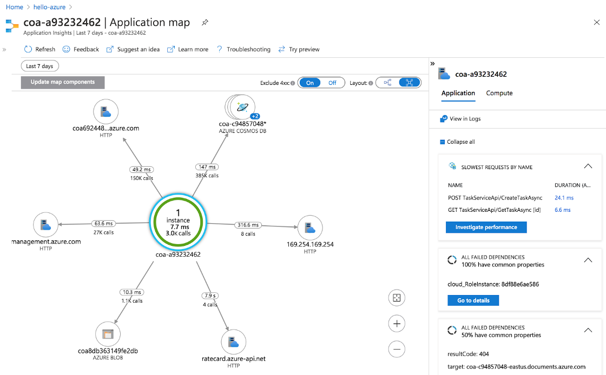
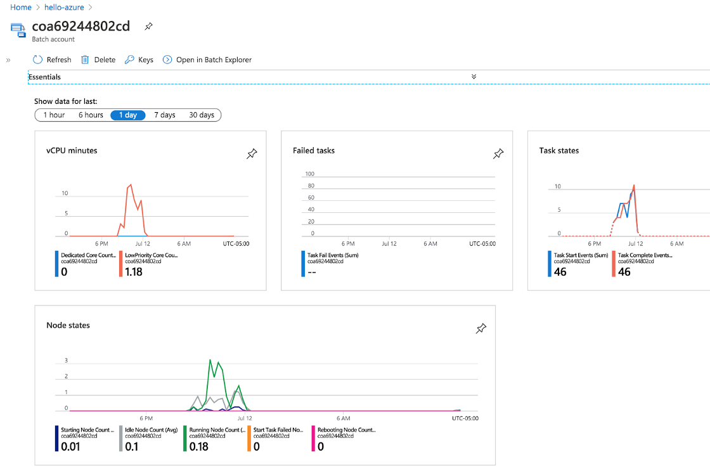
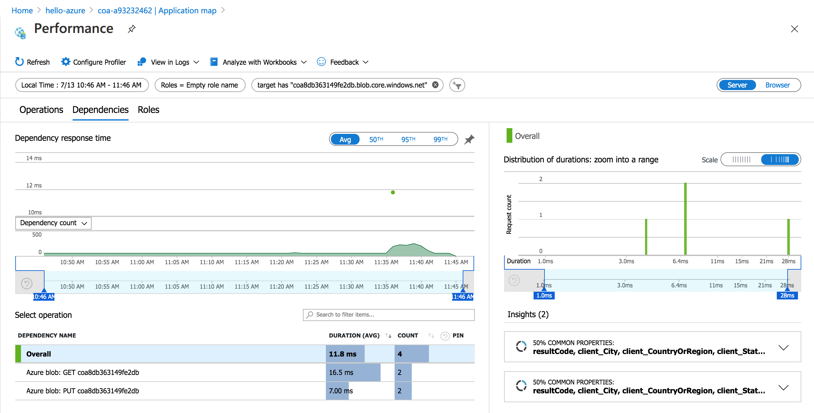

# Tools for Perfomance Tuning

There are a number of tools and interfaces for performance tuning Cromwell-on-Azure workloads.  These include the following:

- Application --> Application Insights
    - Application Map View
    - Application Map Filtered Performance View
- Azure Batch --> Azure Batch usage

- TES --> CosmosDB job task log query tool (uses SQL API)
- BLOB store --> use Container Viewer in Azure Portal

